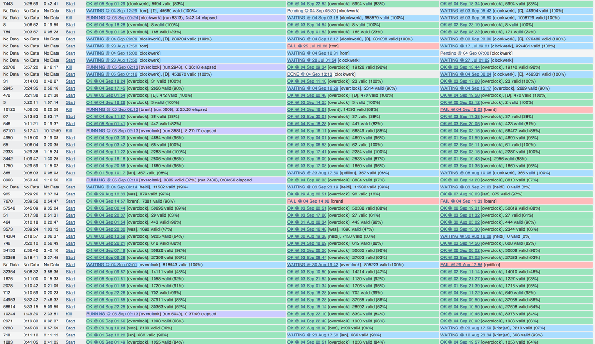

!SLIDE bullets

- Kristján Pétursson
- k@apartmentlist.com
- 
  kristjan

!SLIDE center


# How T-Rex Rules the Dynos

!SLIDE incremental

# We import data

## Lots of it

!SLIDE center



!SLIDE incremental

# Worker Dynos

- Constantly up, mostly idle
- Don't know which picked up the task
- Deploy restarts them
- Heroku restarts them

!SLIDE incremental

# Heroku Run API

```
$ heroku run rake do:something
```

- Dynos runs its task, then exits
- Known process ID
- Don't restart on deploy

!SLIDE center


!SLIDE incremental

# Victory

- Saved 70% of our Heroku bill
- Debugging
- Deploy whenever we want


!SLIDE code large

## [https://github.com/kristjan/tyrano](https://github.com/kristjan/tyrano)
